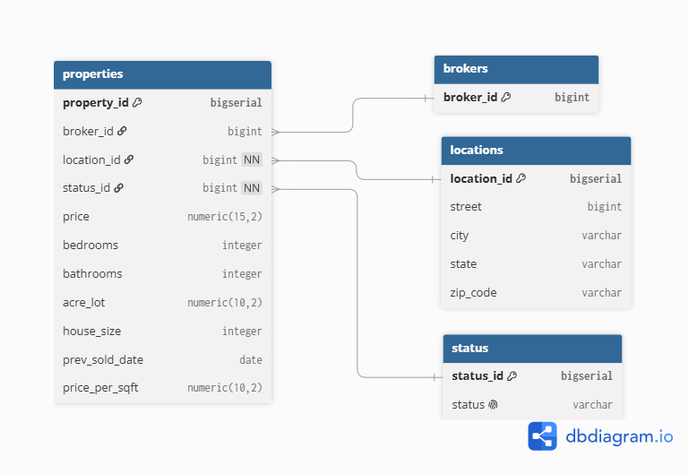

# Real Estate Data Platform

An end-to-end Data Engineering project that transforms a large USA real estate dataset into a clean and normalized PostgreSQL database.

The project demonstrates a complete ETL workflow including data profiling, data cleaning, feature engineering, relational data modeling, PostgreSQL loading, and data quality validation.

The dataset contains more than **2.2 million real estate records**.

---

## Project Architecture

The pipeline follows three main stages:

```text
Raw CSV
   │
   ▼
01 - Data Profiling
   │
   ▼
02 - Data Cleaning & Feature Engineering
   │
   ▼
Processed CSV
   │
   ▼
03 - Database Loading
   │
   ├── brokers
   ├── locations
   ├── status
   └── properties
          │
          ▼
      PostgreSQL
```

The original flat dataset is transformed into a normalized relational model before being loaded into PostgreSQL.

---

## Tech Stack

- Python
- Pandas
- NumPy
- PostgreSQL
- SQL
- SQLAlchemy
- Psycopg2
- Jupyter Notebook
- Git & GitHub
- DBeaver

---

## Dataset

This project uses the **USA Real Estate Dataset** available on Kaggle.

The dataset contains information about real estate listings across the United States, including:

- Property price
- Broker
- Property status
- Bedrooms and bathrooms
- Lot size
- House size
- Street
- City
- State
- ZIP code
- Previous sale date

The dataset is not included in the repository because of its size.

Download it from Kaggle:

**USA Real Estate Dataset — Kaggle**  
https://www.kaggle.com/datasets/ahmedshahriarsakib/usa-real-estate-dataset

After downloading it, place the file at:

```text
data/raw/realtor-data.csv
```

---

## Data Model

The original flat dataset was normalized into four PostgreSQL tables to reduce data redundancy and enforce referential integrity.



### `brokers`

Stores unique broker identifiers.

```text
broker_id (PK)
```

### `locations`

Stores unique property locations.

```text
location_id (PK)
street
city
state
zip_code
```

### `status`

Stores the valid property status values.

```text
status_id (PK)
status
```

Valid statuses are:

- `sold`
- `for_sale`
- `ready_to_build`

### `properties`

Main table containing the real estate records.

```text
property_id (PK)
broker_id (FK)
location_id (FK)
status_id (FK)
price
bedrooms
bathrooms
acre_lot
house_size
prev_sold_date
price_per_sqft
```

---

## ETL Pipeline

### 1. Data Profiling

`01_data_profiling.ipynb`

The raw dataset is explored to understand its structure and identify data quality issues.

The profiling stage includes:

- Dataset dimensions
- Data types
- Missing values
- Duplicate records
- Unique values
- Numerical distributions
- Categorical analysis

---

### 2. Data Cleaning & Feature Engineering

`02_data_cleaning.ipynb`

The dataset is cleaned and standardized before database loading.

Main transformations include:

- Duplicate handling
- Data type corrections
- Missing-value analysis
- ZIP code standardization
- Preservation of leading zeros in ZIP codes
- Date conversion
- Numerical validation
- Creation of `price_per_sqft`

The cleaned dataset is exported to:

```text
data/processed/usa_real_estate_clean.csv
```

---

### 3. PostgreSQL Database Loading

`03_database_loading.ipynb`

The processed dataset is transformed into the relational model and loaded into PostgreSQL.

The loading process includes:

1. Connecting Python to PostgreSQL using SQLAlchemy.
2. Loading the `status` dimension.
3. Loading unique brokers.
4. Building and loading unique locations.
5. Retrieving PostgreSQL-generated surrogate keys.
6. Performing dimension lookups.
7. Mapping `location_id`, `status_id`, and `broker_id` to each property.
8. Building the final `properties` DataFrame.
9. Loading the property records into PostgreSQL.
10. Validating the final database.

A total of **2,224,460 property records** were successfully loaded.

---

## Data Quality & Validation

Several validation checks were performed before and after database loading.

### Row Count Validation

The final Pandas DataFrame contained:

```text
2,224,460 rows
```

The PostgreSQL `properties` table contained:

```text
2,224,460 rows
```

This confirms that no property records were lost or duplicated during the final load.

### Foreign Key Validation

The ETL verified that there were no invalid references between `properties` and its related tables.

```text
Invalid broker foreign keys:   0
Invalid location foreign keys: 0
Invalid status foreign keys:   0
```

### Required Relationships

All properties were successfully mapped to:

```text
location_id → 0 missing
status_id   → 0 missing
```

`broker_id` contains **4,529 NULL values**, reflecting properties where the source dataset did not provide broker information.

The database model intentionally allows `broker_id` to be NULL.

---

## Design Decisions

### Location Normalization

Location information (`street`, `city`, `state`, and `zip_code`) originally appeared directly in every property record.

A separate `locations` table was created and each unique location was assigned a PostgreSQL-generated `location_id`.

This reduces repeated location data and allows `properties` to reference each location through a foreign key.

### Surrogate Keys

PostgreSQL `BIGSERIAL` keys are used for:

- `property_id`
- `location_id`
- `status_id`

These identifiers are generated by PostgreSQL rather than manually in Pandas.

### Broker Modeling

The source dataset only provides a broker identifier and no additional broker attributes.

A separate `brokers` table was retained to enforce referential integrity and allow the model to be extended in the future if additional broker information becomes available.

### Missing Broker Values

Properties without broker information were preserved instead of assigning an artificial or unknown broker.

Therefore:

```text
broker_id = NULL
```

is considered a valid state in the `properties` table.

### ZIP Codes

ZIP codes are treated as strings rather than numerical values because leading zeros are meaningful.

For example:

```text
00601
```

must not become:

```text
601
```

---

## Project Structure

```text
real-estate-data-platform/
│
├── data/
│   ├── raw/
│   │   └── realtor-data.csv
│   │
│   └── processed/
│       └── usa_real_estate_clean.csv
│
├── images/
│
├── notebooks/
│   ├── 01_data_profiling.ipynb
│   ├── 02_data_cleaning.ipynb
│   └── 03_database_loading.ipynb
│
├── sql/
│   └── 01_create_tables.sql
│
├── src/
│
├── .gitignore
└── README.md
```

---

## Database Setup

The PostgreSQL schema can be created using:

```text
sql/01_create_tables.sql
```

The script creates the following tables:

```text
brokers
locations
status
properties
```

including primary keys, foreign keys, constraints, and data types.

---

## Environment Variables

Database credentials are stored locally in a `.env` file and are not committed to Git.

Example:

```text
DB_USER=your_username
DB_PASSWORD=your_password
DB_HOST=localhost
DB_PORT=5432
DB_NAME=your_database
```

The `.env` file is excluded through `.gitignore`.

---

## How to Run

### 1. Clone the repository

```bash
git clone <repository-url>
cd real-estate-data-platform
```

### 2. Download the dataset

Download the dataset from Kaggle and save it as:

```text
data/raw/realtor-data.csv
```

### 3. Create the PostgreSQL database

Create a PostgreSQL database for the project.

Then execute:

```text
sql/01_create_tables.sql
```

### 4. Configure environment variables

Create a `.env` file in the project root containing your PostgreSQL credentials.

### 5. Execute the notebooks

Run the notebooks in this order:

```text
01_data_profiling.ipynb
02_data_cleaning.ipynb
03_database_loading.ipynb
```

---

## Project Status

- ✅ Data Profiling
- ✅ Data Cleaning & Feature Engineering
- ✅ Relational Data Modeling
- ✅ PostgreSQL Database Creation
- ✅ ETL Database Loading
- ✅ Data Quality Validation
- ✅ Referential Integrity Validation
- ⏳ SQL Analytics
- ⏳ Pipeline Automation

---

## Future Improvements

Future versions of the project may include:

- Analytical SQL queries
- Database indexes and query optimization
- Automated ETL execution
- Migration of notebook logic into reusable Python modules
- Pipeline orchestration
- Data visualization
- Additional real estate data sources